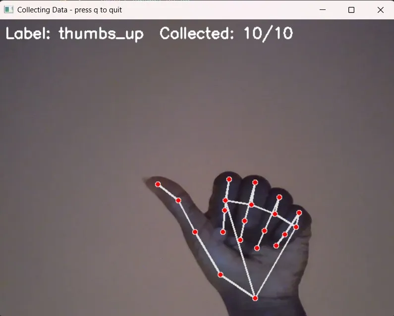

<div align="center">

[](https://git.io/typing-svg)

[](https://github.com/Kushagra-Mangalam)

<!--  -->

</div>

---

```
██╗  ██╗██╗   ██╗███████╗██╗  ██╗ █████╗  ██████╗ ██████╗  █████╗
██║ ██╔╝██║   ██║██╔════╝██║  ██║██╔══██╗██╔════╝ ██╔══██╗██╔══██╗
█████╔╝ ██║   ██║███████╗███████║███████║██║  ███╗██████╔╝███████║
██╔═██╗ ██║   ██║╚════██║██╔══██║██╔══██║██║   ██║██╔══██╗██╔══██║
██║  ██╗╚██████╔╝███████║██║  ██║██║  ██║╚██████╔╝██║  ██║██║  ██║
╚═╝  ╚═╝ ╚═════╝ ╚══════╝╚═╝  ╚═╝╚═╝  ╚═╝ ╚═════╝ ╚═╝  ╚═╝╚═╝  ╚═╝
```

---

## `> whoami`

```bash
About.txt
```

```
Name    : Kushagra Mangalam
Role    : Software Engineer & Developer
Based   : Ludhiana, Punjab, India 🇮🇳
Status  : Currently building, always learning
Focus   : Clean code. Immersive games. Meaningful software.
```

> 🧠 I'm a developer who loves turning ideas into reality — whether it's a survival game with relentless zombies or a full-stack web app. I thrive at the intersection of **systems thinking** and **creative problem solving**. Currently deep into **Unity game development** and **modern web tech**.

---

## `> Skills.json`

<div align="center">

### ⌨️ Languages
[](https://skillicons.dev)

### 🛠️ Frameworks & Tools
[](https://skillicons.dev)

### 🗄️ Databases & Cloud
[](https://skillicons.dev)

### 💻 Environment
[](https://skillicons.dev)

</div>

---

## `> git log --oneline --projects`

---

### `[01]` 🖐️ Hand Gesture Trackpad Controller

<table>
<tr>
<td width="55%" valign="top">

**Real-time gesture control — no mouse needed.**

Detects **21 hand landmarks** via webcam and maps finger gestures to full mouse control: movement, scrolling, clicking, and volume. Features cursor smoothing via moving average, click debouncing, and an activate/deactivate system using 👍 thumbs up and ✊ fist gestures to prevent accidental inputs.

`Python` `OpenCV` `MediaPipe` `PyAutoGUI` `Pynput`

[](https://github.com/Kushagra-Mangalam/hand-gesture-trackpad)

</td>
<td width="45%" valign="top" align="center">





</td>
</tr>
</table>

---

### `[02]` 🏥 AI-Powered Medical Portal

<table>
<tr>
<td width="55%" valign="top">

**Full-stack platform connecting doctors and patients.**

Integrated an **Ollama-based AI chatbot** for intelligent symptom collection and summarization. Features doctor recommendations, live video consultations, and health record tracking — all in one unified portal.

`Python` `MongoDB` `REST APIs` `Ollama` `LLM`

[](https://github.com/Kushagra-Mangalam/ai-medical-portal)

</td>
<td width="45%" valign="top" align="center">

<!-- 📸 PROJECT IMAGE INSTRUCTIONS:
     Upload a screenshot to: assets/projects/medical-portal.png
     Then replace this comment block with:
     
-->

```
[ NO PREVIEW YET ]
Upload to:
assets/projects/
medical-portal.png
```

</td>
</tr>
</table>

---

### `[03]` 🧟 ZombieLockdown

<table>
<tr>
<td width="55%" valign="top">

**Gritty third/first-person zombie survival game in Unity 6.**

Features a fully animated commando character (Mixamo Vanguard) with 8-way locomotion, crouch mechanics, dynamic camera switching, and a relentless undead horde driven by NavMesh AI.

`Unity` `C#` `Mixamo` `NavMesh` `Cinemachine`

[](https://github.com/Kushagra-Mangalam/zombielockdown)

</td>
<td width="45%" valign="top" align="center">

<!-- 📸 PROJECT IMAGE INSTRUCTIONS:
     Upload a screenshot/GIF to: assets/projects/zombielockdown.gif
     Then replace this comment block with:
     
-->

```
[ NO PREVIEW YET ]
Upload to:
assets/projects/
zombielockdown.gif
```

</td>
</tr>
</table>

---

### `[04]` 📺 YouTube Chrome Extension

<table>
<tr>
<td width="55%" valign="top">

**Browser extension to enhance the YouTube experience.**

Built custom content handling features and UI interactions using native browser APIs and frontend scripting. Seamlessly integrates into the YouTube interface with zero performance overhead.

`JavaScript` `Chrome Extension APIs` `HTML` `CSS`

[](https://github.com/Kushagra-Mangalam/youtube-extension)

</td>
<td width="45%" valign="top" align="center">

<!-- 📸 PROJECT IMAGE INSTRUCTIONS:
     Upload a screenshot to: assets/projects/yt-extension.png
     Then replace this comment block with:
     
-->

```
[ NO PREVIEW YET ]
Upload to:
assets/projects/
yt-extension.png
```

</td>
</tr>
</table>

---

### `[05]` 🚗 Arduino Smart Car

<table>
<tr>
<td width="55%" valign="top">

**Autonomous smart car with custom control logic.**

Built on Arduino with embedded C++ — handles obstacle detection, automated steering, and hardware-software integration from scratch. A hands-on dive into the world of embedded systems and robotics.

`Arduino` `C++` `Embedded Systems` `Robotics`

[](https://github.com/Kushagra-Mangalam/arduino-smart-car)

</td>
<td width="45%" valign="top" align="center">

<!-- 📸 PROJECT IMAGE INSTRUCTIONS:
     Upload a photo/video GIF to: assets/projects/smart-car.gif
     Then replace this comment block with:
     
-->

```
[ NO PREVIEW YET ]
Upload to:
assets/projects/
smart-car.gif
```

</td>
</tr>
</table>

---

---

## `> github --stats`

<div align="center">


</div>

<div align="center">

[](https://git.io/streak-stats)

</div>
-----


## `> cat activity_graph.log`

<div align="center">

[](https://github.com/ashutosh00710/github-readme-activity-graph)

</div>

---

## `> ping social --all`

<div align="center">

[](https://linkedin.com/in/Kushagra-Mangalam)
[](https://github.com/Kushagra-Mangalam)
[](https://twitter.com/Kushagra-Mangalam)
[](mailto:your@email.com)
[](https://your-portfolio.dev)

</div>

---

## `> fun_facts.txt`

```javascript
const kushagra = {
  currentlyPlaying  : "my own zombie survival game (someone has to test it 🧟)",
  currentlyBuilding : ["ZombieLockdown in Unity 6", "new web projects"],
  favouriteDebugLine: "it works on my machine",
  coffeePerDay      : "undefined (but > 0)",
  funFact           : "I shoot zombies in Unity and bugs in VSCode",
  openTo            : ["Collaborations", "Open Source", "Internships", "Cool Ideas"]
};
```

---

<div align="center">

```
> session.end()
Thanks for visiting. Don't forget to ⭐ repos you find useful.
The terminal stays open. Come back anytime.

[SYSTEM]: Zombie threat level: CRITICAL. Code anyway.
```

[](https://github.com/Kushagra-Mangalam)

</div>
